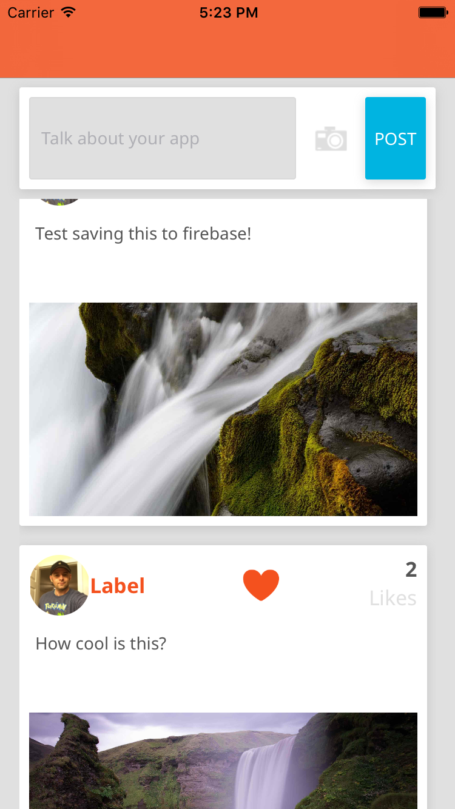
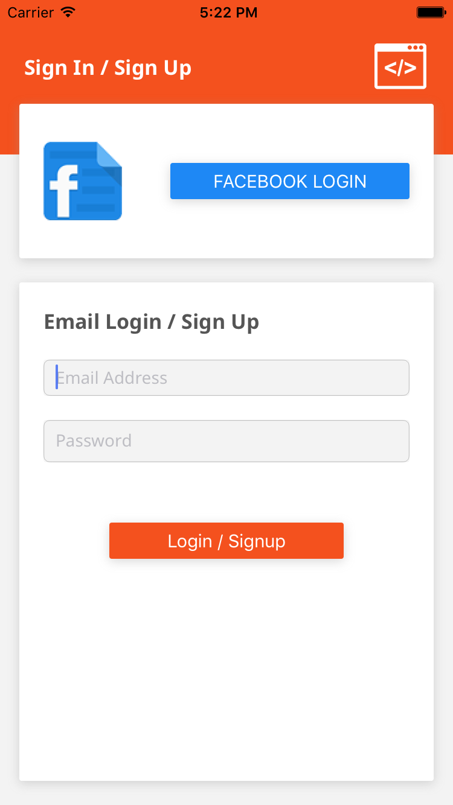

# iOS Mobile App Showcase Social

Just one example of an app completed for Udemy.com course "iOS 9 and Swift 2: From Beginner to Paid Professional" by Mark Price that can be found at:

https://www.udemy.com/ios9-swift/#/

All assets, artwork, supplied as part of course.

This app showcases working with third party API's, in this case Firebase, ImageShack, and Facebook to store data, handle credentials, and store images. Additionally demonstrates attractive UI design based on Google's Marterial Design guidelines.

Do to needing to keep app keys private, this will not run if just downloaded but is intended as a sample/reference for code.

Screenshots:

Main Screen: 

Creditials/Login: 

